# 1、了解Mybatis-Plus

## 1.1 、Mybatis-Plus介绍

MyBatis-Plus（简称 MP）是一个 MyBatis 的增强工具，在 MyBatis 的基础上只做增强不做改变，为简化开发、提高效率而生。 
 官网：[https://mybatis.plus/ ](https://mybatis.plus/)或 https://mp.baomidou.com/

####   愿景

我们的愿景是成为 MyBatis 最好的搭档，就像 魂斗罗 中的 1P、2P，基友搭配，效率翻倍。

## 1.2   、代码以及文档

文档地址：https://mybatis.plus/guide/

源码地址：https://github.com/baomidou/mybatis-plus

# 2、快速开始

对于Mybati整合MP有常常有三种用法，分别是Mybatis+MP、Spring+Mybatis+MP、Spring Boot+Mybatis+MP。

### 2.1 、创建数据库以及表


```mysql
-- 创建测试表	
CREATE TABLE `tb_user` (			
`id` bigint(20) NOT NULL AUTO_INCREMENT COMMENT '主键ID',			
`user_name` varchar(20) NOT NULL COMMENT '用户名',			
`password` varchar(20) NOT NULL COMMENT '密码',			
`name` varchar(30) DEFAULT NULL COMMENT '姓名',			
`age` int(11) DEFAULT NULL COMMENT '年龄',			
`email` varchar(50) DEFAULT NULL COMMENT '邮箱',			
PRIMARY KEY (`id`)			
) ENGINE=InnoDB AUTO_INCREMENT=1 DEFAULT CHARSET=utf8;			
			
-- 插入测试数据			
INSERT INTO `tb_user` (`id`, `user_name`, `password`, `name`,	`age`,	`email`)	VALUES
('1', 'zhangsan', '123456', '张三', '18', 'test1@itcast.cn');			
INSERT INTO `tb_user` (`id`, `user_name`, `password`, `name`,	`age`,	`email`)	VALUES
('2', 'lisi', '123456', '李四', '20', 'test2@itcast.cn');			
INSERT INTO `tb_user` (`id`, `user_name`, `password`, `name`,	`age`,	`email`)	VALUES
('3', 'wangwu', '123456', '王五', '28', 'test3@itcast.cn');			
INSERT INTO `tb_user` (`id`, `user_name`, `password`, `name`,	`age`,	`email`)	VALUES
('4', 'zhaoliu', '123456', '赵六', '21', 'test4@itcast.cn');			
INSERT INTO `tb_user` (`id`, `user_name`, `password`, `name`,	`age`,	`email`)	VALUES
('5', 'sunqi', '123456', '孙七', '24', 'test5@itcast.cn');			

```


### 2.2、**创建工程**


- 导入依赖

- ```xml
  <?xml version="1.0" encoding="UTF-8"?>
  <project xmlns="http://maven.apache.org/POM/4.0.0" xmlns:xsi="http://www.w3.org/2001/XMLSchema-instance" xsi:schemaLocation="http://maven.apache.org/POM/4.0.0
  http://maven.apache.org/xsd/maven-4.0.0.xsd">
  <modelVersion>4.0.0</modelVersion>
  
  <groupId>cn.itcast.mp</groupId>
  <artifactId>itcast-mybatis-plus</artifactId>
  <version>1.0-SNAPSHOT</version>
  <modules>
  <module>itcast-mybatis-plus-simple</module>
  </modules>
  <packaging>pom</packaging>
  
  <dependencies>
  <!-- mybatis-plus插件依赖 -->
  <dependency>
  <groupId>com.baomidou</groupId>
  <artifactId>mybatis-plus</artifactId>
  <version>3.1.1</version>
  </dependency>
  <!-- MySql -->
  	<dependency>
  <groupId>mysql</groupId>
  <artifactId>mysql-connector-java</artifactId>
  <version>5.1.47</version>
  </dependency>
  <!-- 连接池 -->
  <dependency>
  <groupId>com.alibaba</groupId>
  <artifactId>druid</artifactId>
  <version>1.0.11</version>
  </dependency>
  <!--简化bean代码的工具包-->
  <dependency>
  <groupId>org.projectlombok</groupId>
  <artifactId>lombok</artifactId>
  <optional>true</optional>
  <version>1.18.4</version>
  </dependency>
  <dependency>
  <groupId>junit</groupId>
  <artifactId>junit</artifactId>
  <version>4.12</version>
  </dependency>
  <dependency>
  <groupId>org.slf4j</groupId>
  <artifactId>slf4j-log4j12</artifactId>
  <version>1.6.4</version>
  </dependency>
  </dependencies>
  
  <build>
  <plugins>
  <plugin>
  <groupId>org.apache.maven.plugins</groupId>
  <artifactId>maven-compiler-plugin</artifactId>
  <configuration>
  <source>1.8</source>
  <target>1.8</target>
  </configuration>
  </plugin>
  </plugins>
  </build>
  
  </project>
  
  ```


### 2.3、Mybatis + MP

#### 2.3.1 、创建子Module

```xml
?xml version="1.0" encoding="UTF-8"?>
<project xmlns="http://maven.apache.org/POM/4.0.0"
xmlns:xsi="http://www.w3.org/2001/XMLSchema-instance" xsi:schemaLocation="http://maven.apache.org/POM/4.0.0
http://maven.apache.org/xsd/maven-4.0.0.xsd">
<parent>
<artifactId>itcast-mybatis-plus</artifactId>
<groupId>cn.itcast.mp</groupId>
<version>1.0-SNAPSHOT</version>
</parent>
<modelVersion>4.0.0</modelVersion>
<packaging>jar</packaging>
<artifactId>itcast-mybatis-plus-simple</artifactId>

</project>

```

- log4j.properties：

- ```xml
  xmlns:xsi="http://www.w3.org/2001/XMLSchema-instance" xsi:schemaLocation="http://maven.apache.org/POM/4.0.0
  http://maven.apache.org/xsd/maven-4.0.0.xsd">
  <parent>
  <artifactId>itcast-mybatis-plus</artifactId>
  <groupId>cn.itcast.mp</groupId>
  <version>1.0-SNAPSHOT</version>
  </parent>
  <modelVersion>4.0.0</modelVersion>
  <packaging>jar</packaging>
  <artifactId>itcast-mybatis-plussimple</artifactId>
  </project>
  
  ```

  

- log4j.properties：

```properties
log4j.rootLogger=DEBUG,A1
log4j.appender.A1=org.apache.log4j.ConsoleAppender
log4j.appender.A1.layout=org.apache.log4j.PatternLayout log4j.appender.A1.layout.ConversionPattern=[%t] [%c]-[%p] %m%n
```

#### 2.3.2、Mybatis实现查询User

- 第一步，编写mybatis-config.xml文件：

```xml
<?xml version="1.0" encoding="UTF-8" ?>
<!DOCTYPE configuration
		PUBLIC "-//mybatis.org//DTD Config 3.0//EN"
		"http://mybatis.org/dtd/mybatis-3-config.dtd">
<configuration>
<environments default="development">
<environment id="development">
<transactionManager type="JDBC"/>
<dataSource type="POOLED">
<property name="driver" value="com.mysql.jdbc.Driver"/>
	<property name="url" value="jdbc:mysql://127.0.0.1:3306/mp? useUnicode=true&amp;characterEncoding=utf8&amp;autoReconnect=true&amp;allowMultiQuerie s=true&amp;useSSL=false"/>
<property name="username" value="root"/>
<property name="password" value="root"/>
</dataSource>
</environment>
</environments>
<mappers>
<mapper resource="UserMapper.xml"/>
</mappers>
</configuration>

```

-   **第二步，编写User实体对象：（这里使用lombok进行了进化bean操作）**

```
import	lombok.AllArgsConstructor;
import	lombok.Data;
import	lombok.NoArgsConstructor;

@Data 
@NoArgsConstructor 
@AllArgsConstructor
public class User {
	private Long id;
	private String userName; 
	private String password; 
	private String name; 
	private Integer age; 
	private String email;
}
```

- ####   第三步，编写UserMapper接口：

```java

import java.util.List;
public interface UserMapper {
    List<User> findAll();
}
```

-   **第四步，编写UserMapper.xml文件：**

     

  ```
  <?xml version="1.0" encoding="UTF-8" ?>
  <!DOCTYPE mapper
  PUBLIC "-//mybatis.org//DTD Mapper 3.0//EN" "http://mybatis.org/dtd/mybatis-3-mapper.dtd">
  <mapper namespace="cn.itcast.mp.simple.mapper.UserMapper">
  <select id="findAll" resultType="cn.itcast.mp.simple.pojo.User"> select * from tb_user      
  </select>                    
  </mapper>
  ```

- ####   第五步，编写TestMybatis测试用例：

```java
package cn.itcast.mp.simple;

import cn.itcast.mp.simple.mapper.UserMapper;
import cn.itcast.mp.simple.pojo.User;
import org.apache.ibatis.io.Resources;
import org.apache.ibatis.session.SqlSession;
import org.apache.ibatis.session.SqlSessionFactory;
import org.apache.ibatis.session.SqlSessionFactoryBuilder;
import org.junit.Test;

import java.io.InputStream;
import java.util.List;

public class TestMybatis {

@Test
public void testUserList() throws Exception{
String resource = "mybatis-config.xml";
InputStream inputStream = Resources.getResourceAsStream(resource);
SqlSessionFactory sqlSessionFactory = new
SqlSessionFactoryBuilder().build(inputStream);
SqlSession sqlSession = sqlSessionFactory.openSession();

UserMapper userMapper = sqlSession.getMapper(UserMapper.class);
List<User> list = userMapper.findAll();
for (User user : list) {
System.out.println(user);
}

}
}

```

- 测试结果：

- ```
  1	[main] [cn.itcast.mp.simple.mapper.UserMapper.findAll]-[DEBUG] ==> Parameters:
  2	[main] [cn.itcast.mp.simple.mapper.UserMapper.findAll]-[DEBUG] <==	Total: 5
  3	User(id=1, userName=null, password=123456, name=张三, age=18, email=test1@itcast.cn)
  4	User(id=2, userName=null, password=123456, name=李四, age=20, email=test2@itcast.cn)
  5	User(id=3, userName=null, password=123456, name=王五, age=28, email=test3@itcast.cn)
  6	User(id=4, userName=null, password=123456, name=赵六, age=21, email=test4@itcast.cn)
  7	User(id=5, userName=null, password=123456, name=孙七, age=24, email=test5@itcast.cn)
  ```

  

#### 2.3.3、Mybatis+MP实现查询User

- 第一步，将UserMapper继承BaseMapper，将拥有了BaseMapper中的所有方法:

  - ```java
    import cn.itcast.mp.simple.pojo.User;
    import com.baomidou.mybatisplus.core.mapper.BaseMapper;
    
    import java.util.List;
    public interface UserMapper extends BaseMapper<User> {
    List<User> findAll();
    }
    ```

    -    第二步，使用MP中的MybatisSqlSessionFactoryBuilder进程构建：

      - ```java
        import cn.itcast.mp.simple.mapper.UserMapper; import cn.itcast.mp.simple.pojo.User;
        import com.baomidou.mybatisplus.core.MybatisSqlSessionFactoryBuilder; import org.apache.ibatis.io.Resources;
        
        import org.apache.ibatis.session.SqlSession;
        import  org.apache.ibatis.session.SqlSessionFactory; import org.apache.ibatis.session.SqlSessionFactoryBuilder; import org.junit.Test;
        
        import java.io.InputStream; import java.util.List;
        
        public class TestMybatisPlus {
        
        @Test
        public void testUserList() throws Exception{ String resource = "mybatis-config.xml";
        InputStream inputStream = Resources.getResourceAsStream(resource);
        //这里使用的是MP中的MybatisSqlSessionFactoryBuilder SqlSessionFactory sqlSessionFactory = new
        MybatisSqlSessionFactoryBuilder().build(inputStream); SqlSession sqlSession = sqlSessionFactory.openSession();
        
        UserMapper userMapper = sqlSession.getMapper(UserMapper.class);
        
        // 可以调用BaseMapper中定义的方法
        List<User> list = userMapper.selectList(null); for (User user : list) {
        System.out.println(user);
        }
        
        }
        }
        ```

        

-  运行报错：
- 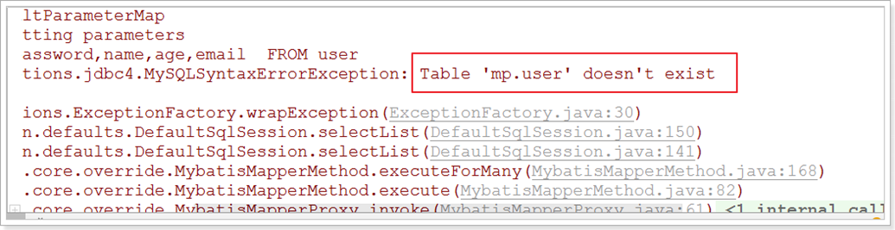


- 测试：

  - ```
    [main] [cn.itcast.mp.simple.mapper.UserMapper.selectList]-[DEBUG] ==> Preparing:
    SELECT id,user_name,password,name,age,email FROM tb_user
    [main] [cn.itcast.mp.simple.mapper.UserMapper.selectList]-[DEBUG] ==> Parameters:
    [main] [cn.itcast.mp.simple.mapper.UserMapper.selectList]-[DEBUG] <== Total: 5
    User(id=1, userName=zhangsan, password=123456, name=张三, age=18, email=test1@itcast.cn) User(id=2, userName=lisi, password=123456, name=李四, age=20, email=test2@itcast.cn) User(id=3, userName=wangwu, password=123456, name=王五, age=28, email=test3@itcast.cn) User(id=4, userName=zhaoliu, password=123456, name=赵六, age=21, email=test4@itcast.cn) User(id=5, userName=sunqi, password=123456, name=孙七, age=24, email=test5@itcast.cn)
    ```

    

- 简单说明：
  - 由于使用了MybatisSqlSessionFactoryBuilder进行了构建，继承的BaseMapper中的方法就载入到了

SqlSession中，所以就可以直接使用相关的方法；

- 如图
- 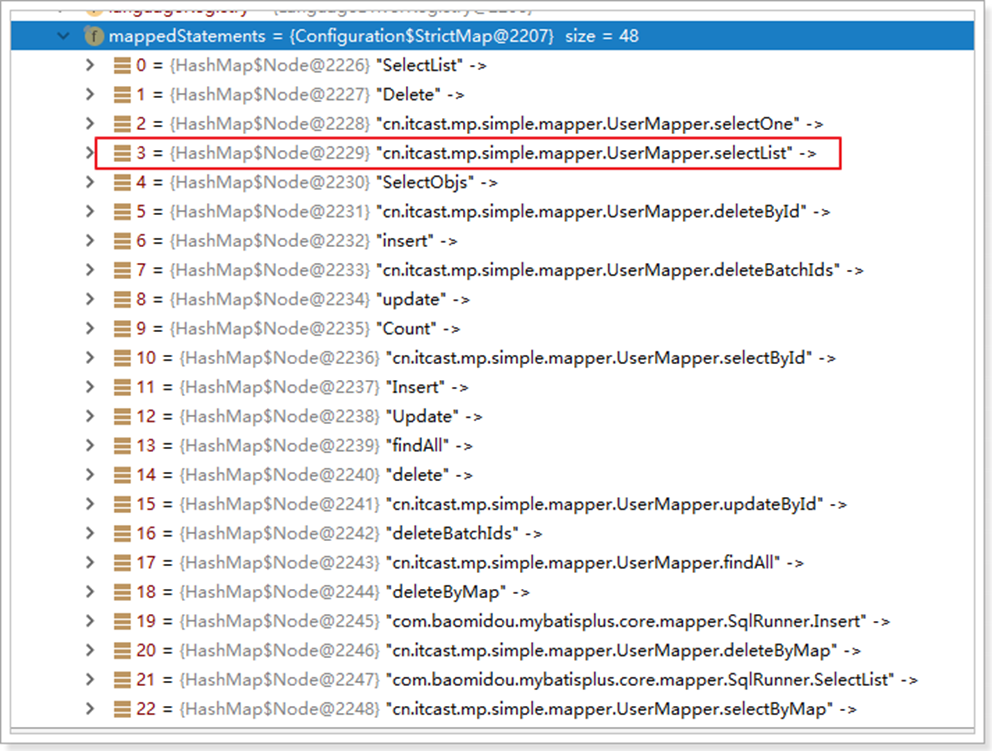

### 2.4、Spring + Mybatis + MP

**引入了Spring框架，数据源、构建等工作就交给了Spring管理。**

#### 2.4.1 、创建子Module

```xml
<?xml version="1.0" encoding="UTF-8"?>
<project xmlns="http://maven.apache.org/POM/4.0.0" xmlns:xsi="http://www.w3.org/2001/XMLSchema-instance" xsi:schemaLocation="http://maven.apache.org/POM/4.0.0
http://maven.apache.org/xsd/maven-4.0.0.xsd">
<parent>
<artifactId>itcast-mybatis-plus</artifactId>
<groupId>cn.itcast.mp</groupId>
<version>1.0-SNAPSHOT</version>
</parent>
<modelVersion>4.0.0</modelVersion>
<artifactId>itcast-mybatis-plus-spring</artifactId>

<properties>
<spring.version>5.1.6.RELEASE</spring.version>
</properties>
<dependencies>
<dependency>
<groupId>org.springframework</groupId>
<artifactId>spring-webmvc</artifactId>
<version>${spring.version}</version>
</dependency>
<dependency>
<groupId>org.springframework</groupId>
<artifactId>spring-jdbc</artifactId>
<version>${spring.version}</version>
</dependency>
<dependency>
<groupId>org.springframework</groupId>
<artifactId>spring-test</artifactId>
<version>${spring.version}</version>
</dependency>
</dependencies>
</project>
```

#### **2.4.2**、实现查询****User**

- 第一步，编写jdbc.properties

  - ```properties
    jdbc.driver=com.mysql.jdbc.Driver
    jdbc.url=jdbc:mysql://127.0.0.1:3306/mp? useUnicode=true&characterEncoding=utf8&autoReconnect=true&allowMultiQueries=true&useSSL
    =false
    jdbc.username=root
    dbc.password=root
    ```

- 第二步，编写applicationContext.xml

  - ```xml
    <?xml version="1.0" encoding="UTF-8"?>
    <beans xmlns="http://www.springframework.org/schema/beans" xmlns:xsi="http://www.w3.org/2001/XMLSchema-instance" xmlns:context="http://www.springframework.org/schema/context" xsi:schemaLocation="http://www.springframework.org/schema/beans
    http://www.springframework.org/schema/beans/spring-beans.xsd http://www.springframework.org/schema/context
    http://www.springframework.org/schema/context/spring-context.xsd">
    <context:property-placeholder location="classpath:*.properties"/>
    
    <!-- 定义数据源 -->
    <bean id="dataSource" class="com.alibaba.druid.pool.DruidDataSource" destroy-method="close">
    <property name="url" value="${jdbc.url}"/>
    <property name="username" value="${jdbc.username}"/>
    <property name="password" value="${jdbc.password}"/>
    <property name="driverClassName" value="${jdbc.driver}"/>
    <property name="maxActive" value="10"/>
    <property name="minIdle" value="5"/>
    </bean>
    
        <!--这里使用MP提供的sqlSessionFactory，完成了Spring与MP的整合-->
    <bean id="sqlSessionFactory" class="com.baomidou.mybatisplus.extension.spring.MybatisSqlSessionFactoryBean">
    <property name="dataSource" ref="dataSource"/>
    </bean>
        
    <!--扫描mapper接口，使用的依然是Mybatis原生的扫描器-->
    <bean class="org.mybatis.spring.mapper.MapperScannerConfigurer">
    <property name="basePackage" value="cn.itcast.mp.simple.mapper"/>
    </bean>
    
    
    </beans>
    ```

- 第三步，编写User对象以及UserMapper接口：

  - ```java
    import com.baomidou.mybatisplus.annotation.TableName; import lombok.AllArgsConstructor;
    import lombok.Data;
    import lombok.NoArgsConstructor;
    @Data 
    @NoArgsConstructor 
    @AllArgsConstructor 
    @TableName("tb_user")
    public class User {
    private Long id;
    private String userName; 
        private String password; 
        private String name; 
        private Integer age; 
        private String email;
    }
    ```

- 第四步，编写测试用例：

  - ```java
    import cn.itcast.mp.simple.mapper.UserMapper; import cn.itcast.mp.simple.pojo.User;
    import org.junit.Test;
    import org.junit.runner.RunWith;
    import org.springframework.beans.factory.annotation.Autowired; import org.springframework.test.context.ContextConfiguration;
    import org.springframework.test.context.junit4.SpringJUnit4ClassRunner;
    
    
    import java.util.List;
    @RunWith(SpringJUnit4ClassRunner.class) 
    @ContextConfiguration(locations = "classpath:applicationContext.xml")
    public class TestSpringMP {
    @Autowired
    private UserMapper userMapper;
    
    @Test
    public void testSelectList(){
    List<User> users = this.userMapper.selectList(null); 
        for (User user : users) {
    		System.out.println(user);
    		}
    	}
    }
    ```

    

- 测试：

  - ```
    [main] [cn.itcast.mp.simple.mapper.UserMapper.selectList]-[DEBUG] ==> Preparing:
    SELECT id,user_name,password,name,age,email FROM tb_user
    [main] [cn.itcast.mp.simple.mapper.UserMapper.selectList]-[DEBUG] ==> Parameters:
    [main] [cn.itcast.mp.simple.mapper.UserMapper.selectList]-[DEBUG] <== Total: 5
    [main] [org.mybatis.spring.SqlSessionUtils]-[DEBUG] Closing non transactional
    SqlSession [org.apache.ibatis.session.defaults.DefaultSqlSession@74287ea3] User(id=1, userName=zhangsan, password=123456, name=张三, age=18, email=test1@itcast.cn)
    User(id=2, userName=lisi, password=123456, name=李四, age=20, email=test2@itcast.cn) User(id=3, userName=wangwu, password=123456, name=王五, age=28, email=test3@itcast.cn) User(id=4, userName=zhaoliu, password=123456, name=赵六, age=21, email=test4@itcast.cn) User(id=5, userName=sunqi, password=123456, name=孙七, age=24, email=test5@itcast.cn)
    
    ```

    

### 2.5、SpringBoot + Mybatis + MP

**使用SpringBoot将进一步的简化MP的整合，需要注意的是，由于使用SpringBoot需要继承parent，所以需要重新创  建工程，并不是创建子Module。**

##### 2.5.1、创建工程

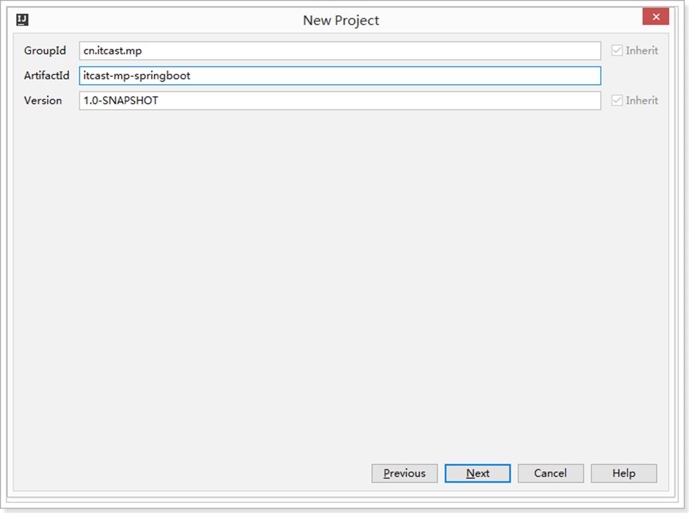

##### **2.5.2、导入依赖**

```
<?xml version="1.0" encoding="UTF-8"?>
<project xmlns="http://maven.apache.org/POM/4.0.0"
xmlns:xsi="http://www.w3.org/2001/XMLSchema-instance"
	xsi:schemaLocation="http://maven.apache.org/POM/4.0.0 http://maven.apache.org/xsd/maven-4.0.0.xsd">
<modelVersion>4.0.0</modelVersion> 6
<parent>
<groupId>org.springframework.boot</groupId>
<artifactId>spring-boot-starter-parent</artifactId>
<version>2.1.4.RELEASE</version>
</parent> 12
<groupId>cn.itcast.mp</groupId>
<artifactId>itcast-mp-springboot</artifactId>
<version>1.0-SNAPSHOT</version> 16
<dependencies>
<dependency>
<groupId>org.springframework.boot</groupId>
<artifactId>spring-boot-starter</artifactId>
<exclusions>
<exclusion>
<groupId>org.springframework.boot</groupId>
<artifactId>spring-boot-starter-logging</artifactId>
</exclusion>
</exclusions>
</dependency>
<dependency>
<groupId>org.springframework.boot</groupId>
<artifactId>spring-boot-starter-test</artifactId>
<scope>test</scope>
</dependency>

<!--简化代码的工具包-->
<dependency>
<groupId>org.projectlombok</groupId>
<artifactId>lombok</artifactId>
<optional>true</optional>
</dependency>
<!--mybatis-plus的springboot支持-->
<dependency>
<groupId>com.baomidou</groupId>
<artifactId>mybatis-plus-boot-starter</artifactId>
<version>3.1.1</version>
</dependency>
<!--mysql驱动-->
<dependency>
<groupId>mysql</groupId>
<artifactId>mysql-connector-java</artifactId>
<version>5.1.47</version>
</dependency>
<dependency>
<groupId>org.slf4j</groupId>
<artifactId>slf4j-log4j12</artifactId>
</dependency>


</dependencies>


<build>
<plugins>
<plugin>
<groupId>org.springframework.boot</groupId>
<artifactId>spring-boot-maven-plugin</artifactId>
</plugin>
</plugins>
</build>


</project>

```

- log4j.properties：

  - ```properties
    log4j.rootLogger=DEBUG,A1	
    log4j.appender.A1=org.apache.log4j.ConsoleAppender log4j.appender.A1.layout=org.apache.log4j.PatternLayout
    log4j.appender.A1.layout.ConversionPattern=[%t] [%c]-[%p] %m%n
    ```

##### 2.5.3编写、application.properties

```properties
spring.application.name = itcast-mp-springboot
spring.datasource.driver-class-name=com.mysql.jdbc.Driver spring.datasource.url=jdbc:mysql://127.0.0.1:3306/mp? useUnicode=true&characterEncoding=utf8&autoReconnect=true&allowMultiQueries=true&useSSL
=false spring.datasource.username=root
spring.datasource.password=root
```

##### **2.5.4 **、编写****pojo**

```
import com.baomidou.mybatisplus.annotation.TableName; import lombok.AllArgsConstructor;
import lombok.Data;
import lombok.NoArgsConstructor;
@Data 
@NoArgsConstructor 
@AllArgsConstructor @TableName("tb_user")
public class User {
	private Long id;
	private String userName; 
	private String password; 
	private String name; 
	private Integer age; 
	private String email;
}
```

##### 2.5.5 、编写mapper

```
import cn.itcast.mp.pojo.User;
import com.baomidou.mybatisplus.core.mapper.BaseMapper;


public interface UserMapper extends BaseMapper<User> {
}

```

##### 2.5.6、**编写启动类**

```java
import org.mybatis.spring.annotation.MapperScan; import org.springframework.boot.SpringApplication; import org.springframework.boot.WebApplicationType;
import org.springframework.boot.autoconfigure.SpringBootApplication;
import org.springframework.boot.builder.SpringApplicationBuilder;
@MapperScan("cn.itcast.mp.mapper") //设置mapper接口的扫描包
@SpringBootApplication
	public class MyApplication {
public static void main(String[] args) {
    SpringApplication.run(MyApplication.class, args);
	}
}
```

##### 2.5.7 、编写测试用例

​	

```
import cn.itcast.mp.mapper.UserMapper; import cn.itcast.mp.pojo.User;
import org.junit.Test;
import org.junit.runner.RunWith;
import org.springframework.beans.factory.annotation.Autowired; import org.springframework.boot.test.context.SpringBootTest; import org.springframework.test.context.junit4.SpringRunner;

import java.util.List;
@RunWith(SpringRunner.class) 
@SpringBootTest

public class UserMapperTest {
	@Autowired
	private UserMapper userMapper;


@Test
public void testSelect() {
	List<User> userList = userMapper.selectList(null); 
	for (User user : userList) {
		System.out.println(user);
		}
	}
}
```

- 测试：

  - ```
    [main] [cn.itcast.mp.mapper.UserMapper.selectList]-[DEBUG] ==> Preparing: SELECT id,user_name,password,name,age,email FROM tb_user
    [main] [cn.itcast.mp.mapper.UserMapper.selectList]-[DEBUG] ==> Parameters:
    [main] [cn.itcast.mp.mapper.UserMapper.selectList]-[DEBUG] <== Total: 5
    [main] [org.mybatis.spring.SqlSessionUtils]-[DEBUG] Closing non transactional
    SqlSession [org.apache.ibatis.session.defaults.DefaultSqlSession@14faa38c]
    User(id=1, userName=zhangsan, password=123456, name=张三, age=18, email=test1@itcast.cn) User(id=2, userName=lisi, password=123456, name=李四, age=20, email=test2@itcast.cn) User(id=3, userName=wangwu, password=123456, name=王五, age=28, email=test3@itcast.cn) User(id=4, userName=zhaoliu, password=123456, name=赵六, age=21, email=test4@itcast.cn) User(id=5, userName=sunqi, password=123456, name=孙七, age=24, email=test5@itcast.cn)
    ```

    

# 3、通用CRUD

 通过前面的学习，我们了解到通过继承BaseMapper就可以获取到各种各样的单表操作，接下来我们将详细讲解这些 操作。

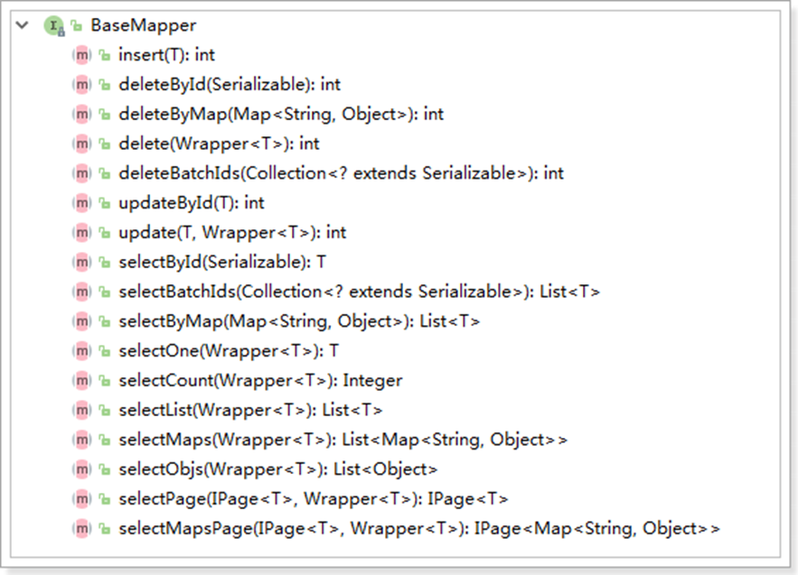

## 3.1 、插入操作

### 3.1.1 、方法定义

```java
/**
*	插入一条记录
*
*	@param entity 实体对象
*/
int insert(T entity);
 	 	
```

### **3.1.2、测试用例**

```java
import cn.itcast.mp.mapper.UserMapper; import cn.itcast.mp.pojo.User;
import org.junit.Test;
import org.junit.runner.RunWith;
import org.springframework.beans.factory.annotation.Autowired; import org.springframework.boot.test.context.SpringBootTest; import org.springframework.test.context.junit4.SpringRunner;

import java.util.List;


@RunWith(SpringRunner.class) 
@SpringBootTest
public class UserMapperTest {


	@Autowired
	private UserMapper userMapper;


	@Test
	public void testInsert(){ 
        User user = new User(); 
        user.setAge(20);
		user.setEmail("test@itcast.cn"); 				user.setName("曹操"); 							user.setUserName("caocao");
		user.setPassword("123456");

		int result = this.userMapper.insert(user); //返回的result是受影响的行数，并不是自增
		System.out.println(user.getId()); //自增后的id会回填到对象中
	}	
		
}		

```

### 3.1.3 、测试

```
[main] [cn.itcast.mp.mapper.UserMapper.insert]-[DEBUG] ==> Preparing: INSERT INTO tb_user ( id, user_name, password, name, age, email ) VALUES ( ?, ?, ?, ?, ?, ? )
[main] [cn.itcast.mp.mapper.UserMapper.insert]-[DEBUG] ==> Parameters: 1122045867793072130(Long), caocao(String), 123456(String), 曹操(String), 20(Integer), test@itcast.cn(String)
[main] [cn.itcast.mp.mapper.UserMapper.insert]-[DEBUG] <==Updates: 1
[main] [org.mybatis.spring.SqlSessionUtils]-[DEBUG] Closing non transactional SqlSession [org.apache.ibatis.session.defaults.DefaultSqlSession@411291e5] result = 1
1122045867793072130
```

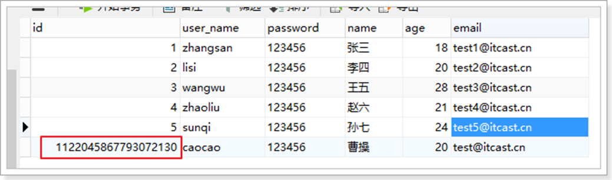

可以看到，数据已经写入到了数据库，但是，id的值不正确，我们期望的是数据库自增长，实际是MP生成了id的值 写入到了数据库。

如何设置id的生成策略呢？

- MP支持的id策略：

  - ```java
    import lombok.Getter;
    
    
    /**
    *	生成ID类型枚举类
    *
    *	@author hubin
    * @since 2015-11-10
    */ 
    @Getter
    public enum IdType {
    /**
    *	数据库ID自增
    */ 
        AUTO(0),
    /**
    *	该类型为未设置主键类型
    */ 
        NONE(1),
    /**
    *	用户输入ID
    *	<p>该类型可以通过自己注册自动填充插件进行填充</p>
    */ 
        INPUT(2),
    
    /* 以下3种类型、只有当插入对象ID 为空，才自动填充。 */
    /**
    *	全局唯一ID (idWorker)
    */ 
        ID_WORKER(3),
    /**
    *	全局唯一ID (UUID)
    */
    	UUID(4),
    /**
    * 字符串全局唯一ID (idWorker 的字符串表示)
    */ 
        ID_WORKER_STR(5);
    
    	private final int key;
    
    
    	IdType(int key) { 
        this.key = key;
    }
    ```

    

- 修改User对象：

  - ```java
    import com.baomidou.mybatisplus.annotation.IdType; import com.baomidou.mybatisplus.annotation.TableId; import com.baomidou.mybatisplus.annotation.TableName; import lombok.AllArgsConstructor;
    import lombok.Data;
    import lombok.NoArgsConstructor;
    @Data 
    @NoArgsConstructor
    @AllArgsConstructor 
    @TableName("tb_user")
    public class User {
    	@TableId(type = IdType.AUTO) //指定id类型为自增长
    	private Long id;
    	private String userName; 
    	private String password; 
    	private String name; 
    	private Integer age; 
    	private String email;
    }
    
    ```

    

- 数据插入成功:
  - 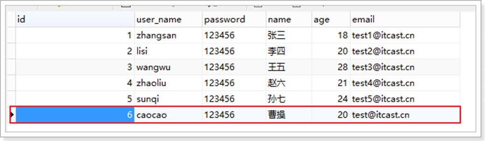

### 3.1.4 、@TableField

在MP中通过**@TableField注解**可以指定字段的一些属性，常常解决的问题有2个：

1、对象中的属性名和**字段名不一致**的问题（非驼峰）
2、对象中的**属性字段**在表中**不存在**的问题

- 使用：	
  - 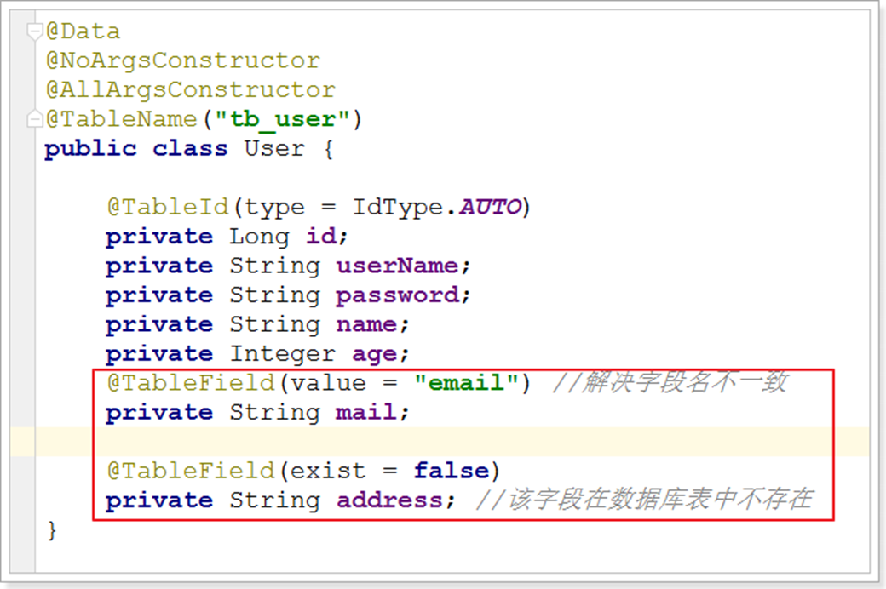

- 其他用法，如大字段不加入查询字段：
  - 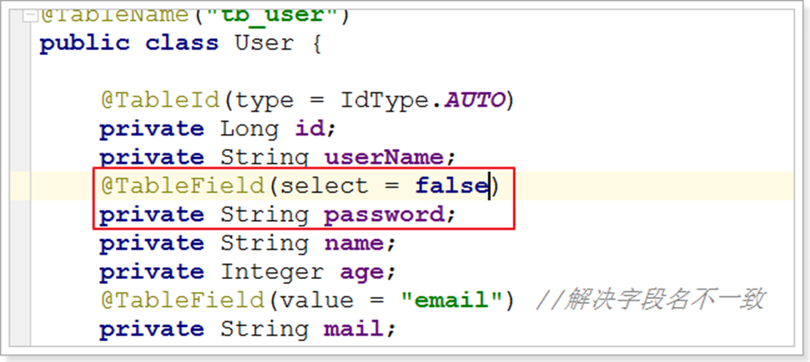

- 效果：
  - 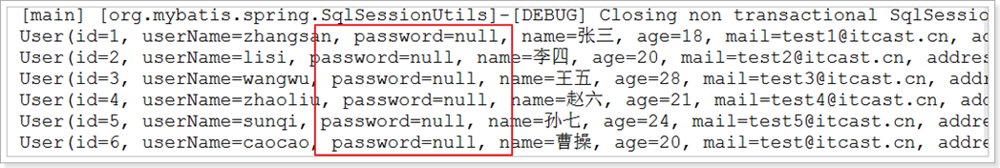

## 3.2 、更新操作

**在MP中，更新操作有2种，一种是根据id更新，另一种是根据条件更新。**

### 3.2.1 、根据id更新

- 方法定义：

  - ```java
    /**
    *	根据 ID 修改
    *
    *	@param entity 实体对象
    */
    int updateById(@Param(Constants.ENTITY) T entity);
    
    ```

    

- 测试：

  - ```
    @RunWith(SpringRunner.class) @SpringBootTest
    public class UserMapperTest {
    	@Autowired
    	private UserMapper userMapper;
    	@Test
    	public void testUpdateById() {
        User user = new User(); 
        user.setId(6L); //主键
        user.setAge(21); //更新的字段
    	
    	//根据id更新，更新不为null的字段
    	this.userMapper.updateById(user);
      }
    }
    ```

    

- 结果：

  - ```
    [main[cn.itcast.mp.mapper.UserMapper.updateById]-[DEBUG] ==> Preparing: UPDATE tb_user SET age=? WHERE id=?
    [main[cn.itcast.mp.mapper.UserMapper.updateById]-[DEBUG] ==> Parameters: 21(Integer), 6(Long)
    [main[cn.itcast.mp.mapper.UserMapper.updateById]-[DEBUG] <==	Updates: 1
    
    ```

    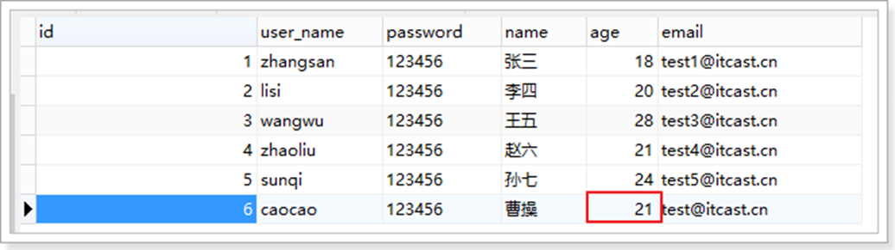

### 3.2.2、根据条件更新

- 方法定义：

  - ```java
    /**
    * 根据 whereEntity 条件，更新记录
    *
    * @param entity    实体对象 (set 条件值,可以为 null)
    * @param updateWrapper 实体对象封装操作类（可以为 null,里面的 entity 用于生成 where 语句）
    */
    int update(@Param(Constants.ENTITY) T entity, @Param(Constants.WRAPPER) Wrapper<T> updateWrappjavaer);
    
    ```

- 测试用例：

  - ```JAVA
    import cn.itcast.mp.mapper.UserMapper; import cn.itcast.mp.pojo.User;
    import com.baomidou.mybatisplus.core.conditions.Wrapper;
    import com.baomidou.mybatisplus.core.conditions.query.QueryWrapper; import com.baomidou.mybatisplus.core.conditions.update.UpdateWrapper; import net.minidev.json.writer.UpdaterMapper;
    import org.junit.Test;
    import org.junit.runner.RunWith;
    import org.springframework.beans.factory.annotation.Autowired; import org.springframework.boot.test.context.SpringBootTest; import org.springframework.test.context.junit4.SpringRunner;
    
    import java.util.List;
    
    
    @RunWith(SpringRunner.class) @SpringBootTest
    public class UserMapperTest {
    
    
    	@Autowired
    	private UserMapper userMapper;
    
    
    	@Test
    	public void testUpdate() {
    		User user = new User(); 				user.setAge(22); //更新的字段
    
    		//更新的条件
    		QueryWrapper<User> wrapper = new QueryWrapper<>(); 
    		wrapper.eq("id", 6);
    
    		//执行更新操作
    		int result = this.userMapper.update(user, wrapper);
    		System.out.println("result = " + result);
    	}
    }
    ```

    

- 或者，通过UpdateWrapper进行更新:

  - ```JAVA
    	@Test
    	public void testUpdate() {
    //更新的条件以及字段
    		UpdateWrapper<User> wrapper = new UpdateWrapper<>(); 
            wrapper.eq("id", 6).set("age", 23);
    
    	//执行更新操作
    	int result = this.userMapper.update(null, wrapper);
    	System.out.println("result = " + result);
    }
    ```

    

- 测试结果：

  - ```
    [main[cn.itcast.mp.mapper.UserMapper.update]-[DEBUG] ==> Preparing: UPDATE tb_user SET age=? WHERE id = ?
    [main[cn.itcast.mp.mapper.UserMapper.update]-[DEBUG] ==> Parameters: 23(Integer), 6(Integer)
    [main[cn.itcast.mp.mapper.UserMapper.update]-[DEBUG] <==	Updates: 1
    
    ```

    **均可达到更新的效果。**

    **关于wrapper更多的用法后面会详细讲解。**

## **3.3、删除操作**

### **3.3.1、deleteById** 

- 方法定义:

  - ```JAVA
    /**
    * 根据 ID 删除
    * @param id 主键ID
    */
     int deleteById(Serializable id);
    
    ```

    

- 测试用例：

  - ```JAVA
    import cn.itcast.mp.mapper.UserMapper; import org.junit.Test;
    import org.junit.runner.RunWith;
    import org.springframework.beans.factory.annotation.Autowired; import org.springframework.boot.test.context.SpringBootTest; import org.springframework.test.context.junit4.SpringRunner;
    @RunWith(SpringRunner.class) @SpringBootTest
    public class UserMapperTest {
    	@Autowired
    	private UserMapper userMapper;
    
    
    	@Test
    	public void testDeleteById() {
    //执行删除操作
    		int result =this.userMapper.deleteById(6L); 				System.out.println("result = " + result);
    }
    }
    ```

    

- 结果

  - ```
    [main[cn.itcast.mp.mapper.UserMapper.deleteById]-[DEBUG] ==> Preparing: DELETE FROM tb_user WHERE id=?
    [main[cn.itcast.mp.mapper.UserMapper.deleteById]-[DEBUG] ==> Parameters: 6(Long)
    [main[cn.itcast.mp.mapper.UserMapper.deleteById]-[DEBUG] <==Updates: 1
    ```

    

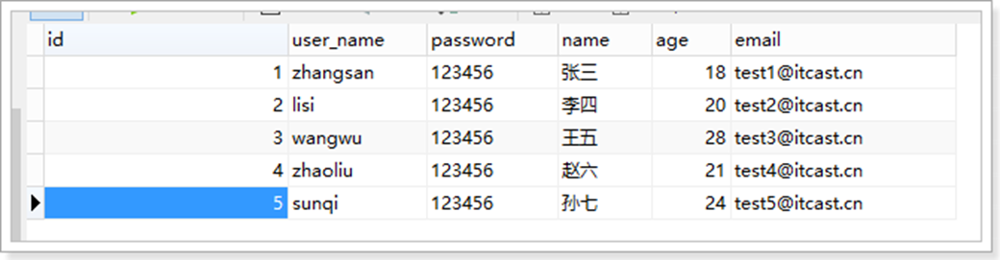

**数据被删除。**


### 3.3.2 、deleteByMap

- 方法定义：

  - ```
    /**
    *	根据 columnMap 条件，删除记录
    *
    *	@param columnMap 表字段 map 对象
    */
    int deleteByMap(@Param(Constants.COLUMN_MAP) Map<String, Object> columnMap);
    
    ```

    

- 测试用例：.

  - ```JAVA
    import cn.itcast.mp.mapper.UserMapper; import org.junit.Test;
    import org.junit.runner.RunWith;
    import org.springframework.beans.factory.annotation.Autowired; import org.springframework.boot.test.context.SpringBootTest; import org.springframework.test.context.junit4.SpringRunner;
    
    import java.util.HashMap; import java.util.Map;
    
    @RunWith(SpringRunner.class) @SpringBootTest
    public class UserMapperTest {
    
    
    	@Autowired
    	private UserMapper userMapper;
    	@Test
    	public void testDeleteByMap() {
    		Map<String, Object> columnMap = new HashMap<>(); 
    		columnMap.put("age",20);
    columnMap.put("name","张三");
    //将columnMap中的元素设置为删除的条件，多个之间为and关系
    		int result =this.userMapper.deleteByMap(columnMap);
    		System.out.println("result = " + result);
    }
    }
    ```

    

- 结果：

  - ```
    [main[cn.itcast.mp.mapper.UserMapper.deleteByMap]-[DEBUG] ==> Preparing: DELETE FROM tb_user WHERE name = ? AND age = ?
    [main[cn.itcast.mp.mapper.UserMapper.deleteByMap]-[DEBUG] ==> Parameters: 张三
    (String), 20(Integer)
    [main[cn.itcast.mp.mapper.UserMapper.deleteByMap]-[DEBUG] <==	Updates: 0
    
    ```

    

### 3.3.3 、delete

- 方法定义：

  - ```
    /**
    * 根据 entity 条件，删除记录
    *
    * @param wrapper 实体对象封装操作类（可以为 null）*/
    int delete(@Param(Constants.WRAPPER) Wrapper<T> wrapper);
    
    ```

    

- 测试用例

  - ```java
    import cn.itcast.mp.mapper.UserMapper; import cn.itcast.mp.pojo.User;
    import com.baomidou.mybatisplus.core.conditions.query.QueryWrapper; import org.junit.Test;
    import org.junit.runner.RunWith;
    import org.springframework.beans.factory.annotation.Autowired; import org.springframework.boot.test.context.SpringBootTest; import org.springframework.test.context.junit4.SpringRunner;
    
    import java.util.HashMap; import java.util.Map;
    
    @RunWith(SpringRunner.class) @SpringBootTest
    public class UserMapperTest {
    
    
    	@Autowired
    	private UserMapper userMapper;
    	@Test
    	public void testDeleteByMap() { 
    		User user = new User(); 				user.setAge(20); 
    		user.setName("张三");
    		//将实体对象进行包装，包装为操作条件
    		QueryWrapper<User> wrapper = new QueryWrapper<>(user);
    
    		int result =this.userMapper.delete(wrapper); 				System.out.println("result = " + result);
    }
    }
    ```

    

- 结果
  - 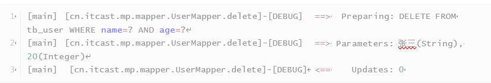

### 3.3.4、deleteBatchIds

- 方法定义

  - ```java
    /**
    * 删除（根据ID 批量删除）
    * @param idList 主键ID列表(不能为 null 以及 empty)
    */
    int deleteBatchIds(@Param(Constants.COLLECTION) Collection<? extends Serializable> idList);
    
    ```

    

- 测试用例

  - ```
    import cn.itcast.mp.mapper.UserMapper; import org.junit.Test;
    import org.junit.runner.RunWith;
    import org.springframework.beans.factory.annotation.Autowired; import org.springframework.boot.test.context.SpringBootTest; import org.springframework.test.context.junit4.SpringRunner;
    
    import java.util.Arrays;
    
    @RunWith(SpringRunner.class) @SpringBootTest
    public class UserMapperTest {
    	@Autowired
    	private UserMapper userMapper;
    
    
    	@Test
    	public void testDeleteByMap() {
    		//根据id集合批量删除
    		int result =this.userMapper.deleteBatchIds(Arrays.asList(1L,10L,20L)); 
    		System.out.println("result = " + result);
    }
    }
    ```

    

- 结果
  - 

## 3.4、查询操作

**MP提供了多种查询操作，包括根据id查询、批量查询、查询单条数据、查询列表、分页查询等操作。**

### 3.4.1 、selectById

- 方法定义

  - ```java
    /**
    *	根据 ID 查询
    *
    *	@param id 主键ID
    */
    T selectById(Serializable id);
    
    ```

    

- 测试用例

  - ```
    import cn.itcast.mp.mapper.UserMapper; import cn.itcast.mp.pojo.User;
    import org.junit.Test;
    import org.junit.runner.RunWith;
    import org.springframework.beans.factory.annotation.Autowired; import org.springframework.boot.test.context.SpringBootTest; import org.springframework.test.context.junit4.SpringRunner;
    
    @RunWith(SpringRunner.class) @SpringBootTest
    public class UserMapperTest {
    	@Autowired
    	private UserMapper userMapper;
    
    
    	@Test
    	public void testSelectById() {
    		//根据id查询数据
    		User user =this.userMapper.selectById(2L); 
    		System.out.println("result = " + user);
    }
    }
    ```

    

- 结果

  - ```
     result = User(id=2, userName=lisi, password=123456, name=李四, age=20, email=test2@itcast.cn, address=null)
    ```

    

### 3.4.2 、selectBatchIds

- 方法定义

  - ```
    /**
    * 查询（根据ID 批量查询）
    *
    * @param idList 主键ID列表(不能为 null 以及 empty)*/
    List<T> selectBatchIds(@Param(Constants.COLLECTION) Collection<? extends Serializable> idList);
    
    ```

    

- 测试用例

  - ```java
    import cn.itcast.mp.mapper.UserMapper; import cn.itcast.mp.pojo.User;
    import org.junit.Test;
    import org.junit.runner.RunWith;
    import org.springframework.beans.factory.annotation.Autowired; import org.springframework.boot.test.context.SpringBootTest; import org.springframework.test.context.junit4.SpringRunner;
    
    import java.util.Arrays; 
    import java.util.List;
    
    
    @RunWith(SpringRunner.class) @SpringBootTest
    public class UserMapperTest {
    	@Autowired
    	private UserMapper userMapper;
    
    
    	@Test
    	public void testSelectBatchIds() {
    		//根据id集合批量查询
    		List<User> users =this.userMapper.selectBatchIds(Arrays.asList(2L, 3L, 10L)); 
    		for (User user : users) {
    		System.out.println(user);
    		}
    	}
    }
    ```

    

- 结果

  - ```
    [main[cn.itcast.mp.mapper.UserMapper.selectBatchIds]-[DEBUG] ==> Preparing: SELECT id,user_name,password,name,age,email FROM tb_user WHERE id IN ( ? , ? , ? )
    [main[cn.itcast.mp.mapper.UserMapper.selectBatchIds]-[DEBUG] ==> Parameters: 2(Long),
    3(Long), 10(Long)
    [main[cn.itcast.mp.mapper.UserMapper.selectBatchIds]-[DEBUG] <==Total: 2
    
    User(id=2, userName=lisi, password=123456, name=李四, age=20, email=test2@itcast.cn,
    address=null)
    User(id=3, userName=wangwu, password=123456, name=王五, age=28, email=test3@itcast.cn, address=null)
    
    ```

    

### 3.4.3 、selectOne

- 方法定义：

  - ```
    /**
    * 根据 entity 条件，查询一条记录
    * @param queryWrapper 实体对象封装操作类（可以为 null）*/
    T selectOne(@Param(Constants.WRAPPER) Wrapper<T> queryWrapper);
    
    ```

    

- 测试用例

  - ```java
    import cn.itcast.mp.mapper.UserMapper; import cn.itcast.mp.pojo.User;
    import com.baomidou.mybatisplus.core.conditions.query.QueryWrapper; import org.junit.Test;
    import org.junit.runner.RunWith;
    import org.springframework.beans.factory.annotation.Autowired; import org.springframework.boot.test.context.SpringBootTest; import org.springframework.test.context.junit4.SpringRunner;
    
    @RunWith(SpringRunner.class) @SpringBootTest
    	public class UserMapperTest {
    
    
    	@Autowired
    	private UserMapper userMapper;
    
    
    	@Test
    	public void testSelectOne() {
    		QueryWrapper<User> wrapper = newQueryWrapper<User>(); 
    		wrapper.eq("name", "李四");
    		
    		//根据条件查询一条数据，如果结果超过一条会报错
    		User user =this.userMapper.selectOne(wrapper);
    java
    }	
    }	System.out.println(user);
    		}
    ```

    

- 结果

  - ```
    [main[cn.itcast.mp.mapper.UserMapper.selectOne]-[DEBUG] ==> Preparing: SELECT id,user_name,password,name,age,email FROM tb_user WHERE name = ?
    [main[cn.itcast.mp.mapper.UserMapper.selectOne]-[DEBUG] ==> Parameters: 李四(String)
    [main[cn.itcast.mp.mapper.UserMapper.selectOne]-[DEBUG] <==	Total: 1
    
    User(id=2, userName=lisi, password=123456, name=李四, age=20, email=test2@itcast.cn, address=null)
    
    ```

    

### 3.4.4 、selectCount

- 方法定义：

  - ```java
    /**
    * 根据 Wrapper 条件，查询总记录数
    * @param queryWrapper 实体对象封装操作类（可以为 null） 
    */
    IntegerselectCount(@Param(Constants.WRAPPER) Wrapper<T> queryWrapper);
    
    ```

    

- 测试用例

  - ```java
    import cn.itcast.mp.mapper.UserMapper; import cn.itcast.mp.pojo.User;
    import com.baomidou.mybatisplus.core.conditions.query.QueryWrapper; import org.junit.Test;
    import org.junit.runner.RunWith;
    import org.springframework.beans.factory.annotation.Autowired; import org.springframework.boot.test.context.SpringBootTest; import org.springframework.test.context.junit4.SpringRunner;
    
    @RunWith(SpringRunner.class) @SpringBootTest
    public class UserMapperTest {
    
    
    @Autowired
    private UserMapper userMapper;
    
    
    @Test
    public void testSelectCount() {
    QueryWrapper<User> wrapper = new QueryWrapper<User>(); wrapper.gt("age", 23); //年龄大于23岁
    
    //根据条件查询数据条数
    import cn.itcast.mp.mapper.UserMapper; import cn.itcast.mp.pojo.User;
    import com.baomidou.mybatisplus.core.conditions.query.QueryWrapper; import org.junit.Test;
    import org.junit.runner.RunWith;
    import org.springframework.beans.factory.annotation.Autowired; import org.springframework.boot.test.context.SpringBootTest; import org.springframework.test.context.junit4.SpringRunner;
    
    @RunWith(SpringRunner.class) @SpringBootTest
    	public class UserMapperTest {
    
    
    	@Autowired
    	private UserMapper userMapper;
    
    
    	@Test
    	public void testSelectCount() {
    		QueryWrapper<User> wrapper = newQueryWrapper<User>(); 
    		wrapper.gt("age", 23); //年龄大于23岁
    
    //根据条件查询数据条数
    		Integer count =this.userMapper.selectCount(wrapper);
    		System.out.println("count = " + count);
    }java
    }
    ```

    

- 结果

  - ```
    [main[cn.itcast.mp.mapper.UserMapper.selectCount]-[DEBUG] ==> Preparing: SELECT COUNT( 1 ) FROM tb_user WHERE age > ?
    [main[cn.itcast.mp.mapper.UserMapper.selectCount]-[DEBUG] ==> Parameters: 23(Integer)
    [main[cn.itcast.mp.mapper.UserMapper.selectCount]-[DEBUG] <==Total: 1
    
    count = 2
    ```

    

### 3.4.5 、selectList

- 方法定义

  - ```
     /**
    * 根据 entity 条件，查询全部记录
    * @param queryWrapper 实体对象封装操作类（可以为 null）	*/
    
    List<T>selectList(@Param(Constants.WRAPPER) Wrapper<T> queryWrapper);
    
    ```

    

- 测试用例：

  - ```java
    import cn.itcast.mp.mapper.UserMapper; import cn.itcast.mp.pojo.User;
    import com.baomidou.mybatisplus.core.conditions.query.QueryWrapper; import org.junit.Test;
    import org.junit.runner.RunWith;
    import org.springframework.beans.factory.annotation.Autowired; import org.springframework.boot.test.context.SpringBootTest; import org.springframework.test.context.junit4.SpringRunner;
    
    import java.util.List;
    
    
    @RunWith(SpringRunner.class) @SpringBootTest
    public class UserMapperTest {
    
    
    @Autowired
    private UserMapper userMapper;
    
    
    @Test
    public void testSelectList() {
    QueryWrapper<User> wrapper = new QueryWrapper<User>(); wrapper.gt("age", 23); //年龄大于23岁
    import cn.itcast.mp.mapper.UserMapper; import cn.itcast.mp.pojo.User;
    import com.baomidou.mybatisplus.core.conditions.query.QueryWrapper; import org.junit.Test;
    import org.junit.runner.RunWith;
    import org.springframework.beans.factory.annotation.Autowired; import org.springframework.boot.test.context.SpringBootTest; import org.springframework.test.context.junit4.SpringRunner;
    
    import java.util.List;
    
    
    @RunWith(SpringRunner.class) @SpringBootTest
    public class UserMapperTest {
    
    
    	@Autowired
    	private UserMapper userMapper;
    
    
    	@Test
    	public void testSelectList() {
    		QueryWrapper<User> wrapper = newQueryWrapper<User>();
            wrapper.gt("age", 23); //年龄大于23岁
    		//根据条件查询数据
    		List<User> users =this.userMapper.selectList(wrapper); 
    		for (User user : users) {
    		System.out.println("user = " + user);java
    		}
    	}
    }
    ```

    

- 结果

  - ```java
    [main[cn.itcast.mp.mapper.UserMapper.selectList]-[DEBUG] ==> Preparing: SELECT id,user_name,password,name,age,email FROM tb_user WHERE age > ?
    [main[cn.itcast.mp.mapper.UserMapper.selectList]-[DEBUG] ==> Parameters: 23(Integer)
    [main[cn.itcast.mp.mapper.UserMapper.selectList]-[DEBUG] <==Total: 2
    
    user = User(id=3, userName=wangwu, password=123456, name=王五, age=28,
    email=test3@itcast.cn, address=null)
    user = User(id=5, userName=sunqi, password=123456, name=孙七, age=24, email=test5@itcast.cn, address=null)
    
    ```

    

### 3.4.6、selectPage

- 方法定义

  - ```java
    /**
    * 根据 entity 条件，查询全部记录（并翻页）
    *
    * @param page	分页查询条件（可以为 RowBounds.DEFAULT）
    * @param queryWrapper 实体对象封装操作类（可以为 null）
    */
    IPage<T> selectPage(IPage<T> page,@Param(Constants.WRAPPER) Wrapper<T> queryWrapper);
    
    ```

    

- 配置分页插件：

  - ```java
    import com.baomidou.mybatisplus.extension.plugins.PaginationInterceptor; import org.mybatis.spring.annotation.MapperScan;
    import org.springframework.context.annotation.Bean;
    import org.springframework.context.annotation.Configuration;
    
    
    @Configuration
    @MapperScan("cn.itcast.mp.mapper") //设置mapper接口的扫描包
    public class MybatisPlusConfig {
    
    
    	/**
    	* 分页插件
    	*/ java
    	@Bean
    	public PaginationInterceptor paginationInterceptor() {
    		return new PaginationInterceptor();
    }
    }
    ```

    

- 测试用例

  - ```java
    import cn.itcast.mp.mapper.UserMapper;
    import cn.itcast.mp.pojo.User;
    import com.baomidou.mybatisplus.core.conditions.query.QueryWrapper;
    import com.baomidou.mybatisplus.core.metadata.IPage;
    importcom.baomidou.mybatisplus.extension.plugins.pagination.Page;
    import org.junit.Test;
    import org.junit.runner.RunWith;
    import org.springframework.beans.factory.annotation.Autowired;
    import org.springframework.boot.test.context.SpringBootTest;
    import org.springframework.test.context.junit4.SpringRunner; 
    import java.util.List; 
    
    @RunWith(SpringRunner.class)
    @SpringBootTest
    public class UserMapperTest { 19
    	@Autowired
    	private UserMapper userMapper; 22
    	@Test
    	public void testSelectPage() {
    	QueryWrapper<User> wrapper = new QueryWrapper<User>();
    	wrapper.gt("age", 20); //年龄大于20岁
    	Page<User> page = new Page<>(1,1); 
    	//根据条件查询数据
    	IPage<User> iPage = this.userMapper.selectPage(page, wrapper);
    	System.out.println("数据总条数：" + iPage.getTotal());
    	System.out.println("总页数：" + iPage.getPages());
    
    
    	List<User> users = iPage.getRecords();
    	for (User user : users) {
    	System.out.println("user = " + user); 	}
    	}
    
      }
    
    ```

    

- 结果：

  - ```
    [main[cn.itcast.mp.mapper.UserMapper.selectPage]-[DEBUG] ==> Preparing: SELECT COUNT(1) FROM tb_user WHERE age > ?
    [main[cn.itcast.mp.mapper.UserMapper.selectPage]-[DEBUG] ==> Parameters: 20(Integer)
    [main[cn.itcast.mp.mapper.UserMapper.selectPage]-[DEBUG] ==> Preparing: SELECT id,user_name,password,name,age,email FROM tb_user WHERE age > ? LIMIT ?,?
    [main[cn.itcast.mp.mapper.UserMapper.selectPage]-[DEBUG] ==> Parameters: 20(Integer),
    0(Long), 1(Long)
    [main[cn.itcast.mp.mapper.UserMapper.selectPage]-[DEBUG] <==Total: 1
    [main[org.mybatis.spring.SqlSessionUtils]-[DEBUG] Closing non transactional
    SqlSession [org.apache.ibatis.session.defaults.DefaultSqlSession@6ecd665]
    数据总条数：3 总页数：3
    user = User(id=3, userName=wangwu, password=123456, name=王五, age=28,
    email=test3@itcast.cn, address=null)
    
    
    ```

    

## 3.5 、SQL注入的原理

- 前面我们已经知道，MP在启动后会将BaseMapper中的一系列的方法注册到meppedStatements中，那么究竟是如  何注入的呢？流程又是怎么样的？下面我们将一起来分析下。


- 在MP中，ISqlInjector负责SQL的注入工作，它是一个接口，AbstractSqlInjector是它的实现类，实现关系如下：

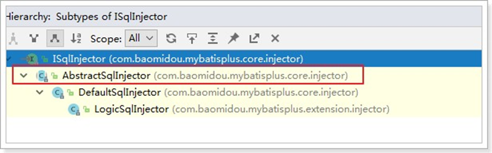

- 在AbstractSqlInjector中，主要是由inspectInject()方法进行注入的，如下：

  - ```java
    @Override
    public void inspectInject(MapperBuilderAssistant builderAssistant, Class<?> mapperClass) {
    	Class<?> modelClass = extractModelClass(mapperClass); 
    	if (modelClass != null) {
    	String className = mapperClass.toString(); 
    	Set<String>mapperRegistryCache=GlobalConfigUtils.getMapperRegistryCache(builderAssistant.getConfiguration()); 
    	if (!mapperRegistryCache.contains(className)) {
    	List<AbstractMethod> methodList = this.getMethodList(); 
            if(CollectionUtils.isNotEmpty(methodList)) {
                TableInfo tableInfo = TableInfoHelper.initTableInfo(builderAssistant,modelClass);
    		// 循环注入自定义方法
    			methodList.forEach(m -> m.inject(builderAssistant, mapperClass, modelClass, tableInfo));
    } else {
                logger.debug(mapperClass.toString() + ", No effective injection methodwas found.");
    	}
    		mapperRegistryCache.add(className); 	}
    	}
      }
    
    ```

    - 在实现方法中， **methodList.forEach(m -> m.inject(builderAssistant, mapperClass, modelClass, tableInfo));** 是关键，循环遍历方法，进行注入。

- 最终调用抽象方法injectMappedStatement进行真正的注入：
  - 

```java
	/**
	* 注入自定义 MappedStatement
	*
	* @param mapperClass mapper 接口
	* @param modelClass mapper 泛型
	* @param tableInfo	数据库表反射信息
	* @return MappedStatement
	*/
	public abstract MappedStatement injectMappedStatement(Class<?> mapperClass, Class<?
> modelClass, TableInfo tableInfo);

```

- 查看该方法的实现：
  - 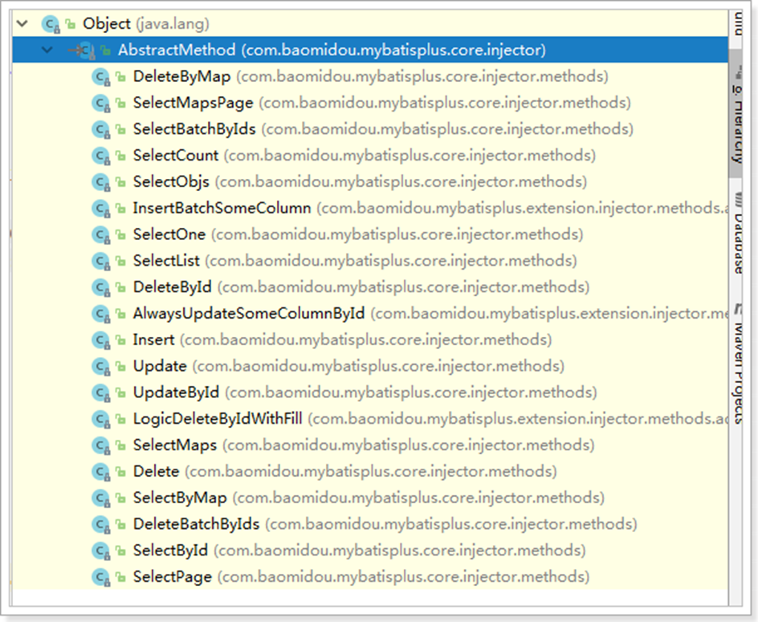

- 以SelectById为例查看：

  - ```java
    public class SelectById extends AbstractMethod {
    	@Override
    	public MappedStatement injectMappedStatement(Class<?> mapperClass, Class<?> modelClass, TableInfotableInfo) {
            SqlMethod sqlMethod = SqlMethod.LOGIC_SELECT_BY_ID; SqlSource sqlSource = new RawSqlSource(configuration,                                                                       	String.format(sqlMethod.getSql(),
            sqlSelectColumns(tableInfo, false), 
            tableInfo.getTableName(), 
            tableInfo.getKeyColumn(),
            tableInfo.getKeyProperty(),
            tableInfo.getLogicDeleteSql(true, false)), Object.class);
            return this.addSelectMappedStatement(mapperClass, sqlMethod.getMethod(),sqlSource,modelClass, tableInfo);
    }
    }
    
    ```

    可以看到，生成了SqlSource对象，再将SQL通过**addSelectMappedStatement**方法**添加**到**meppedStatements**中。

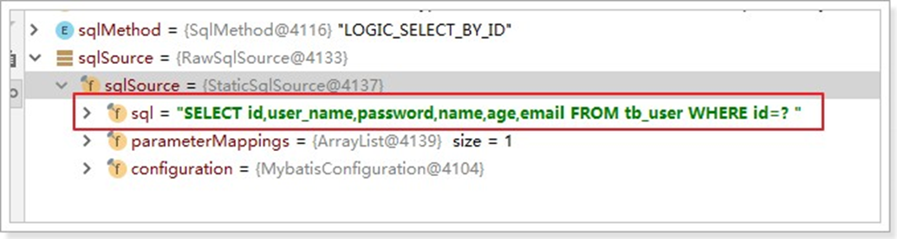

# 4、配置

  [在MP中有大量的配置，其中有一部分是Mybatis原生的配置，另一部分是MP的配置，详情：https://mybatis.plus/c onfig/](https://mybatis.plus/config/)

下面我们对常用的配置做讲解。

## 4.1 、基本配置

### 4.1.1 、configLocation

MyBatis 配置文件位置，如果您有单独的 MyBatis 配置，请将其路径配置到 configLocation 中。 MyBatis Configuration 的具体内容请参考MyBatis 官方文档

- Spring Boot：

```x'm'l
mybatis-plus.config-location = classpath:mybatis-config.xml
```

- Spring MVC：

  - ```xml
    	<bean id="sqlSessionFactory" class="com.baomidou.mybatisplus.extension.spring.MybatisSqlSessionFactoryBean">
    	<property name="configLocation" value="classpath:mybatis-config.xml"/>
    	</bean>
    
    ```

    

### 4.1.2 、mapperLocations

**MyBatis Mapper 所对应的 XML 文件位置，如果您在 Mapper 中有自定义方法（XML 中有自定义实现），需要进行该配置，告诉 Mapper 所对应的 XML 文件位置。**

- xmlSpring Boot：

  - ```x'm'l
    mybatis-plus.mapper-locations =classpath*:mybatis/*.xml
    ```

    

- Spring MVC：

  - ```x'm'l
    	<bean id="sqlSessionFactory" class="com.baomidou.mybatisplus.extension.spring.MybatisSqlSessionFactoryBeaxmln">
    	<property name="mapperLocations" value="classpath*:mybatis/*.xml"/>
    	</bean>
    
    ```

    

- **Maven多模块项目的扫描路径**需要以**classpath**：开头（即加载多个jar包下的XML文件）

- UserMapper.xml：

  - ```xml
    <?xml version="1.0" encoding="UTF-8" ?>
    <!DOCTYPE mapper
    PUBLIC "-//mybatis.org//DTD Mapper 3.0//EN" "http://mybatis.org/dtd/mybatis-3-mapper.dtd">
    <mapper namespace="cn.itcast.mp.mapper.UserMapper">
    	<select id="findById" resultType="cn.itcast.mp.pojo.User"> select* from tb_user where id = #{id}</select>
    
    </mapper>
    
    ```

    

```java
import cn.itcast.mp.pojo.User;
importcom.baomidou.mybatisplus.core.mapper.BaseMapper;

public interface UserMapper extendsBaseMapper<User> {
	User findById(Long id);
}
```

- 测试用例：

  - ```java
    import cn.itcast.mp.mapper.UserMapper; import cn.itcast.mp.pojo.User;
    import org.junit.Test;
    import org.junit.runner.RunWith;
    import org.springframework.beans.factory.annotation.Autowired; import org.springframework.boot.test.context.SpringBootTest; import org.springframework.test.context.junit4.SpringRunner;
    
    @RunWith(SpringRunner.class) @SpringBootTest
    public class UserMapperTest {
    
    
    @Autowired
    private UserMapper userMapper;
    
    
    @Test
    public void testSelectPage() {
    User user = this.userMapper.findById(2L); System.out.println(user);
    	}
    }
    ```

- 运行结果
  - 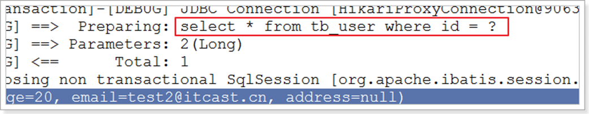

### 4.1.3 、typeAliasesPackage

- **MyBaits 别名包扫描路径，通过该属性可以给包中的类注册别名，注册后在 Mapper 对应的 XML 文件中可以直接使用类名，而不用使用全限定的类名（即 XML 中调用的时候不用包含包名）。**

- Spring Boot：
  - 

```xml
mybatis-plus.type-aliases-package = cn.itcast.mp.pojo
```

- Spring MVC：

  - ```xml
    	<bean id="sqlSessionFactory" class="com.baomidou.mybatisplus.extension.spring.MybatisSqlSessionFactoryBean">
    		<property name="typeAliasesPackage" value="com.baomidou.mybatisplus.samples.quickstart.entity"/>
    	</bean>
    ```

    

## 4.2 、进阶配置

### 4.2.1 、mapUnderscoreToCamelCase

-   类型： **boolean**

-   默认值：**true**

**是否开启自动驼峰命名规则（camel case）映射，即从经典数据库列名 A_COLUMN（下划线命名） 到经典 Java 属性名 aColumn（驼峰命名） 的类似映射。**

1. 注意：此属性在 MyBatis 中原默认值为 false，在 MyBatis-Plus 中，此属性也将用于生成最终的 SQL 的 select body
2. 如果数据库命名符合规则**无需使**用**@TableField**注解指定数据库字段名


- 示例（SpringBoot）：

  - ```
    1	#关闭自动驼峰映射，该参数不能和mybatis-plus.config-location同时存在
    2	mybatis-plus.configuration.map-underscore-to-camel-case=false
    ```

    

### 4.2.2 、cacheEnabled

-   类型： **boolean**

-   默认值：**true**

全局地开启或关闭配置文件中的所有映射器已经配置的任何缓存，默认为 true。示例：

```
mybatis-plus.configuration.cache-enabled=false
```

## 4.3 、DB 策略配置

### 4.3.1 、idType

-   类型： **com.baomidou.mybatisplus.annotation.IdType**

-   默认值：**ID_WORKER**

- 全局默认主键类型，设置后，即可省略实体对象中的@TableId(type = IdType.AUTO)配置。示例：

  - SpringBoot：

    - ```
      mybatis-plus.global-config.db-config.id-type=auto
      ```

- SpringMVC：

  - ```xml
    	<!--这里使用MP提供的sqlSessionFactory，完成了Spring与MP的整合-->
    		<bean id="sqlSessionFactory" class="com.baomidou.mybatisplus.extension.spring.MybatisSqlSessionFactoryBean">
    	<property name="dataSource" ref="dataSource"/>
    	<property name="globalConfig">
    	<bean class="com.baomidou.mybatisplus.core.config.GlobalConfig">
    	<property name="dbConfig">
    	<bean
    class="com.baomidou.mybatisplus.core.config.GlobalConfig$DbConfig">
    	<property name="idType" value="AUTO"/>
    	</bean>
    	</property>
    	</bean>
    	</property>
    	</bean>
    
    ```

    

### 4.3.2、tablePrefix

-   类型： **string**

-   默认值：**null**

**表名前缀，全局配置后可省略@TableName()配置。**

- SpringBoot：

  - ```
    mybatis-plus.global-config.db-config.table-prefix=tb_
    ```

    

- SpringMVC：

  - ```x'm'l
    <bean id="sqlSessionFactory" class="com.baomidou.mybatisplus.extension.spring.MybatisSqlSessionFactoryBean">
    	<property name="dataSource" ref="dataSource"/>
    	<property name="globalConfig">
    	<bean class="com.baomidou.mybatisplus.core.config.GlobalConfig">
    	<property name="dbConfig">
    	<bean
    class="com.baomidou.mybatisplus.core.config.GlobalConfig$DbConfig">
    	<property name="idType" value="AUTO"/>
    	<property name="tablePrefix" value="tb_"/>
    	</bean>
    	</property>
    	</bean>
    	</property>
    	</bean>
    
    ```

    

# 5、条件构造器

**在MP中，Wrapper接口的实现类关系如下：**


**可以看到，AbstractWrapper和AbstractChainWrapper是重点实现，接下来我们重点学习AbstractWrapper以及其子类。**

- 说明：**QueryWrapper(LambdaQueryWrapper) 和 UpdateWrapper(LambdaUpdateWrapper) 的父类 用于生成 sql 的 where 条件, entity 属性也用于生成 sql 的 where 条件 注意: entity 生成的 where 条件与 使用各个 api 生成的 where 条件没有任何关联行为**

- 官网文档地址：https://mybatis.plus/guide/wrapper.html

## 5.1 、allEq

### 5.1.1 、说明

```
allEq(Map<R, V> params)
allEq(Map<R, V> params, boolean null2IsNull)
allEq(boolean condition, Map<R, V> params, boolean null2IsNull)
```

